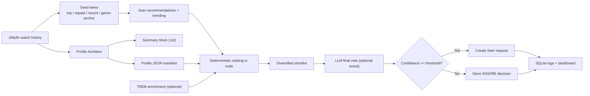

# Vanguarr

[](https://github.com/sparksbenjamin/Vanguarr/actions/workflows/docker.yml)
[](#local-development)
[](LICENSE)

Vanguarr is a hybrid media-request engine for Jellyfin and the Arr stack.

It turns real Jellyfin watch history into persistent per-user taste manifests, builds recommendation seed lanes from that history, pulls candidate titles from a Seer-compatible request service, scores them in code, and only uses an LLM as a lightweight assist instead of the source of truth. When a title clears the configured confidence threshold, Vanguarr submits the request automatically.

The result is a system that is easier to trust, easier to tune, and easier to operate than a "just ask the model" workflow.

## Why Vanguarr

- Deterministic first: recommendation scoring happens in code and is stored for review.
- Persistent profiles: each user gets a durable JSON manifest plus a derived summary block.
- LLMs stay narrow: they suggest adjacent lanes and provide a final vote, but they do not own the whole pipeline.
- Operator-friendly UI: dashboard, health board, decision log, and manifest editor are built in.
- Host-visible runtime state: SQLite history, profiles, and logs live under `./data`.
- Safe deployment model: Dockerized, single-container friendly, and compatible with arbitrary non-root UIDs in group `0`.

## What It Does

Vanguarr runs two cooperating engines:

- `Profile Architect` reads Jellyfin playback history, groups repeat watches, ranks genres, infers format and release-era preferences, optionally asks the LLM for a few adjacent discovery lanes, and writes a persistent profile manifest to disk.
- `Decision Engine` builds recommendation seed lanes from top watched, repeat watched, recent, and genre-anchor titles, pulls a blended candidate pool from Seer recommendations plus trending, enriches the best items with TMDb metadata, scores them in code, applies a small LLM adjustment, and requests only titles that clear your threshold.



## Feature Highlights

- FastAPI web application with a built-in operator UI
- APScheduler-based recurring jobs with manual run controls
- Jellyfin integration through standard `/Users` and `/Items` APIs
- No Jellyfin Playback Reporting plugin required
- Seer discovery via recommendations and trending endpoints
- TMDb enrichment for keywords, talent, brands, franchises, certifications, and providers
- Hybrid confidence model that blends deterministic scoring with an LLM vote
- Duplicate protection against already watched, already managed, or already requested media
- Searchable decision log with stored reasoning and request outcomes
- Editable manifest workflow for operator overrides and explicit feedback

## Web Interface And Endpoints

| Route | Purpose |
| --- | --- |
| `/` | Main dashboard with health, manual triggers, scheduler state, recent requests, and profile cards |
| `/logs` | "War Room" decision log with search across usernames, titles, and reasoning |
| `/manifest` | Profile manifest editor with live summary preview |
| `/healthz` | Lightweight container health probe |
| `/api/health` | Cached JSON health snapshot for Jellyfin, Seer, TMDb, and the active LLM provider |
| `/actions/profile-architect` | Manual Profile Architect trigger |
| `/actions/decision-engine` | Manual Decision Engine trigger |
| `/manifest/save` | Saves the canonical JSON manifest and regenerates its summary block |

## Quick Start

### Prerequisites

You need these integrations configured before Vanguarr can make real request decisions:

- Jellyfin server URL and API key
- Seer-compatible request service URL and API key
- writable `./data` directory for runtime state

These are optional but strongly recommended:

- TMDb credentials for metadata enrichment
- an LLM provider (`ollama`, `openai`, or `anthropic`) for adjacent-lane suggestions and final vote assistance

### Run With Docker Compose

1. Copy [`.env.example`](.env.example) to `.env`.
2. Fill in the required Jellyfin and Seer values.
3. Optionally add TMDb and LLM provider settings.
4. Start the stack:

```bash
docker compose up -d --build
```

5. Open the UI:

```text
http://localhost:8000
```

6. From the dashboard, run `Profile Architect` once to generate manifests, then run `Decision Engine` to score candidates immediately instead of waiting for the scheduled jobs.

The included [`docker-compose.yml`](docker-compose.yml) mounts `./data` into `/data`, which means profiles, logs, and the SQLite database stay visible on the host.

### Run The Published GHCR Image

```yaml
services:
  vanguarr:
    image: ghcr.io/sparksbenjamin/vanguarr:latest
    container_name: vanguarr
    restart: unless-stopped
    ports:
      - "8000:8000"
    env_file:
      - .env
    volumes:
      - ./data:/data
```

## Configuration

The full configuration surface lives in [`.env.example`](.env.example). These are the settings most operators care about first.

### Core Integrations

| Variable | Required | Notes |
| --- | --- | --- |
| `JELLYFIN_BASE_URL` | Yes | Base Jellyfin URL |
| `JELLYFIN_API_KEY` | Yes | Needed to list users and read played history |
| `SEER_BASE_URL` | Yes | Base URL for a Seer-compatible request service. A trailing `/api/v1` is accepted and normalized away. |
| `SEER_API_KEY` | Yes | Needed for discovery and request creation |
| `SEER_REQUEST_USER_ID` | No | Optional request owner override |

### Optional Enrichment

| Variable | Required | Notes |
| --- | --- | --- |
| `TMDB_API_READ_ACCESS_TOKEN` | No | Preferred TMDb auth method |
| `TMDB_API_KEY` | No | Alternative TMDb auth method |
| `TMDB_LANGUAGE` | No | Defaults to `en-US` |
| `TMDB_WATCH_REGION` | No | Defaults to `US` |

If no TMDb credential is set, Vanguarr still runs. It simply skips TMDb enrichment.

### LLM Providers

| Variable | Required | Notes |
| --- | --- | --- |
| `LLM_PROVIDER` | No | `ollama`, `openai`, or `anthropic` |
| `LLM_MODEL` | No | Model name or LiteLLM-formatted identifier |
| `OLLAMA_API_BASE` | For Ollama | Defaults to `http://ollama:11434` |
| `OPENAI_API_KEY` | For OpenAI | Required when `LLM_PROVIDER=openai` |
| `OPENAI_API_BASE` | No | Optional override |
| `ANTHROPIC_API_KEY` | For Anthropic | Required when `LLM_PROVIDER=anthropic` |
| `ANTHROPIC_API_BASE` | No | Optional override |

Important behavior:

- LLM support is optional. If the LLM is unavailable, Decision Engine falls back to deterministic scoring and Profile Architect skips the profile-side enrichment step gracefully.
- Bare Ollama model names like `glm-4.7-flash:latest` are accepted and normalized to LiteLLM form.
- If `LLM_TIMEOUT_SECONDS` is blank, Vanguarr defaults to `180` seconds for Ollama and `45` seconds for hosted providers.

### Scheduling And Tuning

| Variable | Default | What it controls |
| --- | --- | --- |
| `SCHEDULER_ENABLED` | `true` | Enables the built-in APScheduler jobs |
| `PROFILE_CRON` | `0 3 * * 0` | Weekly Profile Architect run in the configured timezone |
| `DECISION_CRON` | `0 4 * * *` | Daily Decision Engine run in the configured timezone |
| `REQUEST_THRESHOLD` | `0.72` | Minimum hybrid confidence required to request media |
| `PROFILE_HISTORY_LIMIT` | `40` | Number of Jellyfin history items used per user |
| `CANDIDATE_LIMIT` | `160` | Maximum pre-rank candidate pool size |
| `TRENDING_CANDIDATE_LIMIT` | `100` | Max trending titles mixed into the pool |
| `DECISION_SHORTLIST_LIMIT` | `15` | Diversified shortlist size before LLM evaluation |
| `RECOMMENDATION_SEED_LIMIT` | `6` | Max watch-history seeds per user |
| `TMDB_SEED_ENRICHMENT_LIMIT` | `6` | Max watched seeds enriched for profile signals |
| `TMDB_CANDIDATE_ENRICHMENT_LIMIT` | `30` | Max ranked candidates enriched before final rerank |
| `GLOBAL_EXCLUSIONS` | `No Horror,No Reality TV` | Global guardrails applied to every decision |

Useful extra knobs from [`.env.example`](.env.example):

- `PROFILE_LLM_ENRICHMENT_ENABLED` disables the profile-side adjacent-lane suggestion step if you want a fully deterministic profile build.
- `PROFILE_LLM_ENRICHMENT_MAX_OUTPUT_TOKENS` keeps that optional profile-side LLM assist intentionally small.
- `SCHEDULER_ENABLED=false` is the right setting when you want dashboard-driven manual runs only.

## How Profiles Work

Each user profile is stored as two files under `./data/profiles`:

- `username.json`: the canonical structured manifest
- `username.txt`: the derived human-readable summary block

The JSON manifest is the source of truth. The summary block is regenerated from it whenever you save the profile in the manifest editor.

### Fields Vanguarr Derives Automatically

- `top_titles`
- `repeat_titles`
- `recent_momentum`
- `top_genres`
- `ranked_genres`
- `primary_genres`
- `secondary_genres`
- `recent_genres`
- `format_preference`
- `release_year_preference`
- `discovery_lanes`
- `top_keywords`
- `favorite_people`
- `preferred_brands`
- `favorite_collections`

### Fields Operators Can Safely Tune

- `adjacent_genres`
- `adjacent_themes`
- `explicit_feedback`
- `profile_exclusions`
- `operator_notes`

Example manifest shape:

```json
{
  "profile_version": "v5",
  "profile_state": "ready",
  "username": "alice",
  "primary_genres": ["Sci-Fi", "Thriller"],
  "adjacent_genres": ["Adventure"],
  "adjacent_themes": ["found family"],
  "explicit_feedback": {
    "liked_titles": [],
    "disliked_titles": [],
    "liked_genres": [],
    "disliked_genres": []
  },
  "profile_exclusions": ["No Horror"],
  "operator_notes": "Prefer high-conviction sci-fi with strong source affinity."
}
```

## Runtime Data

Mount `./data` to `/data` if you want direct access to all runtime artifacts.

| Path | Purpose |
| --- | --- |
| `./data/vanguarr.db` | SQLite database for decision history, requests, and task runs |
| `./data/profiles/*.json` | Canonical user manifests |
| `./data/profiles/*.txt` | Derived summary blocks |
| `./data/logs/vanguarr.log` | Application log file |

This layout is what powers the dashboard, War Room, and manifest editor.

## Deployment Notes

### Jellyfin

- Vanguarr reads watched history through Jellyfin's normal item APIs.
- It uses played-state filters and `DatePlayed` sorting on `/Items`.
- The Jellyfin Playback Reporting plugin is not required.

### Docker, Unraid, And OpenShift-Style Platforms

- Mutable runtime data lives under `/data`, not `/app`.
- The container is prepared for arbitrary non-root UIDs that are members of group `0`.
- For Unraid or host-based Ollama, you can add:

```yaml
extra_hosts:
  - "host.docker.internal:host-gateway"
```

and point `OLLAMA_API_BASE` at `http://host.docker.internal:11434`.

- Outside Docker-based runtimes, do not rely on `host.docker.internal`; use real service DNS or routes instead.

### Scaling

- With SQLite and the in-process scheduler, run a single replica.
- If you need multiple web replicas, disable the built-in scheduler in the web pods and move scheduling and persistence to external services.
- Use `/healthz` for container health probes.

## Local Development

The repo is small enough to run locally without Docker if you prefer.

### Setup

```bash
python -m venv .venv
. .venv/bin/activate
pip install -r requirements.txt
cp .env.example .env
uvicorn app.main:app --reload --host 0.0.0.0 --port 8000
```

On Windows PowerShell, activate the venv with:

```powershell
.venv\Scripts\Activate.ps1
```

### Tests

```bash
python -m pytest
```

## Container Images And CI

The repo ships with multi-arch Docker build automation:

- published image: `ghcr.io/sparksbenjamin/vanguarr`
- target platforms: `linux/amd64`, `linux/arm64`
- workflow: [`.github/workflows/docker.yml`](.github/workflows/docker.yml)
- bake definition: [`docker-bake.hcl`](docker-bake.hcl)

If you want to publish to another registry, override `REGISTRY_IMAGE` in [`docker-bake.hcl`](docker-bake.hcl) or adjust the GitHub Actions metadata step.

## Design Principles

Vanguarr is intentionally opinionated about where intelligence should live:

- Watch history and profile state are durable, inspectable, and stored locally.
- Candidate ranking is deterministic first and explainable after the fact.
- TMDb adds evidence, not authority.
- The LLM is a scoped assistant, not the primary ranking engine.
- Every request decision leaves a paper trail.

That makes it much easier to understand why the system requested something, why it ignored something, and what to tune next.

## License

This project is licensed under the GNU GPL v3. See [`LICENSE`](LICENSE).
