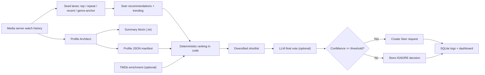

# How Vanguarr Works

This page is the technical map of the system behind the pitch in the main [README](../README.md).

## The Short Version

Vanguarr has one core job: turn real household watch behavior into better media decisions.

It does that by combining:

* watch history from Jellyfin or Plex
* durable per-user taste manifests
* deterministic ranking in code
* optional TMDb enrichment
* optional LLM assistance
* Seer-compatible request creation
* native Jellyfin suggested views

## System Flow



## Profile Architect

`Profile Architect` is the part that learns the household.

For each user, it can derive:

* top titles
* repeat watches
* recent momentum
* ranked genres
* release-era preferences
* format preferences
* discovery lanes
* favored people, brands, and collections

It writes that result as:

* `username.json` as the canonical profile manifest
* `username.txt` as the readable summary block

## Decision Engine

`Decision Engine` is the part that scouts outward.

It:

* builds seeds from watched history
* pulls candidates from Seer recommendations and trending feeds
* enriches the best candidates with TMDb data when available
* scores candidates in code
* optionally asks an LLM for a final assist
* creates requests only when the final confidence clears your threshold

That means the LLM is helpful, but not in charge.

## Suggested Views In Jellyfin

Vanguarr can also work inward, not just outward.

When the Jellyfin companion plugin is installed:

* `Library Sync` indexes what is actually available in Jellyfin
* Vanguarr builds per-user suggestion snapshots from that indexed catalog
* The plugin resolves those snapshots back to real Jellyfin library items
* Jellyfin exposes them as native `Suggested Movies` and `Suggested Shows` views

This avoids:

* symlink libraries
* duplicate metadata trees
* per-user library explosions
* brittle filesystem tricks

For setup details, see [Jellyfin Plugin Setup](jellyfin-plugin.md).

## Why The Profiles Matter

Vanguarr is designed around durable user state instead of temporary recommendations.

That makes it easier to:

* inspect what the system thinks a user likes
* correct it manually
* add exclusions and operator notes
* understand why something was suggested or ignored

Example manifest shape:

```json
{
  "profile_version": "v5",
  "profile_state": "ready",
  "username": "alice",
  "primary_genres": ["Sci-Fi", "Thriller"],
  "adjacent_genres": ["Adventure"],
  "adjacent_themes": ["found family"],
  "explicit_feedback": {
    "liked_titles": [],
    "disliked_titles": [],
    "liked_genres": [],
    "disliked_genres": []
  },
  "profile_exclusions": ["No Horror"],
  "operator_notes": "Prefer high-conviction sci-fi with strong source affinity."
}
```

## Design Principles

Vanguarr is opinionated about where intelligence should live:

* watch history and profile state should be durable and inspectable
* ranking should be deterministic first
* TMDb should add evidence, not authority
* LLMs should assist, not dominate
* every decision should leave a paper trail

That is what makes Vanguarr feel more like a scout reporting back to the ARR stack than a black-box oracle making calls on your behalf.

## Related Docs

* [Configuration Reference](configuration.md)
* [Jellyfin Plugin Setup](jellyfin-plugin.md)
